# Ghidra-ReAGS Quick Start

*Extract compiled AGS scripts and export Ghidra pseudo-C on Windows — no command line required.*

This guide walks you through extracting compiled AGS scripts from a game with **AGSUnpacker**, opening them in **Ghidra 10.4** with the **ReAGS** extension, and saving the decompiler output as a **`.c` text file**. It is written for Windows users and gamers who are new to Ghidra and reverse engineering.

**Important:** the result is **Ghidra pseudo-C** — an automated best guess at the script logic — **not** a recovered copy of the game's original AGS source files.

---

## Before you start

### What you need

- [ ] A Windows PC
- [ ] The game's **`.exe`** file (your copy of the game you want to inspect)
- [ ] **[.NET 6 Desktop Runtime](https://dotnet.microsoft.com/en-us/download/dotnet/6.0)** (required to run AGSUnpacker — install if `AGSUnpacker.exe` refuses to start)
- [ ] A **64-bit JDK** for Ghidra (Ghidra 10.4 officially requires **JDK 17** or newer — see Step 3)
- [ ] About **2 GB** free disk space (Ghidra download ~353 MB, ~1 GB installed, plus JDK ~112 MB and project files)
- [ ] [TODO: time estimate — e.g. "About 45–60 minutes the first time"]

### What you will end up with

- A folder of `.scom3` script files extracted from the game
- A Ghidra project containing one imported script
- An exported **`.c`** file with Ghidra's pseudo-C decompilation attempt (one file per imported script)

> **Important:** Use **AGSUnpacker** for the extraction step. Do not substitute another tool for that part.

### Words you'll see

A few terms this guide uses often:

| Term | Plain English |
|------|---------------|
| **`.scom3`** | A compiled AGS script file pulled out of a game — bytecode, not readable source text |
| **AGSVM** | The script format Ghidra/ReAGS expects on import (you will confirm this in the Import dialog) |
| **Project Manager** | Ghidra's start screen — create projects and import files here |
| **CodeBrowser** | Ghidra's analysis window — open a `.scom3` here to browse and export results |
| **pseudo-C** | C-like text Ghidra guesses from the bytecode — not the game's original AGS scripts |
| **JDK** | Java Development Kit — Ghidra needs this installed separately |

### Downloads (bookmark these)

| Tool | Version / file | Link |
|------|----------------|------|
| AGSUnpacker | **v010** — `AGSUnpacker_v010_x64.zip` (~452 KB) → run **`AGSUnpacker.exe`** | [AGSUnpacker v010 release](https://github.com/adm244/AGSUnpacker/releases/tag/v010) |
| Ghidra | **10.4** — `ghidra_10.4_PUBLIC_20230928.zip` (~353 MB) | [Ghidra 10.4 release (direct zip)](https://github.com/NationalSecurityAgency/ghidra/releases/download/Ghidra_10.4_build/ghidra_10.4_PUBLIC_20230928.zip) · [All releases](https://github.com/NationalSecurityAgency/ghidra/releases/tag/Ghidra_10.4_build) |
| ReAGS | **20240301** — `ghidra_10_4_PUBLIC_20240301_ReAGS.zip` (~64 KB) · Ghidra **10.4** only | [ReAGS 20240301 release](https://github.com/adm244/Ghidra-ReAGS/releases/tag/20240301) |
| Temurin JDK | **17+** (64-bit) — Ghidra requires a JDK; we use Temurin below, but other installs work | [Adoptium Temurin releases](https://adoptium.net/temurin/releases/) |

---

## Step 1: Extract `.scom3` scripts with AGSUnpacker

AGS games store compiled scripts inside the game data. **AGSUnpacker** pulls those out as `.scom3` files you can open in Ghidra.

1. Download **`AGSUnpacker_v010_x64.zip`** (~452 KB) from the [AGSUnpacker v010 release](https://github.com/adm244/AGSUnpacker/releases/tag/v010).
   - Use the **x64** zip on modern 64-bit Windows PCs.
2. Unzip the download. You should get a folder named **`AGSUnpacker_v010_x64`** containing **`AGSUnpacker.exe`** and a few support files.
3. Double-click **`AGSUnpacker.exe`** to open the program.
   - If Windows says the app cannot run, install the **[.NET 6 Desktop Runtime](https://dotnet.microsoft.com/en-us/download/dotnet/6.0)** first, then try again.
4. Click **`Unpack Assets`** and select your game's **`.exe`** file.
5. Click **`Extract Scripts from Assets`**.

### You should see

- A **`scripts`** folder containing many **`.scom3`** files — including **`globalscript.scom3`** (the main game script) and room scripts such as **`room1.scom3`**, **`room2.scom3`**, etc.
- [TODO: Confirm exactly where AGSUnpacker writes the `scripts` folder — same directory as the unpacked assets? Next to the game `.exe`?]

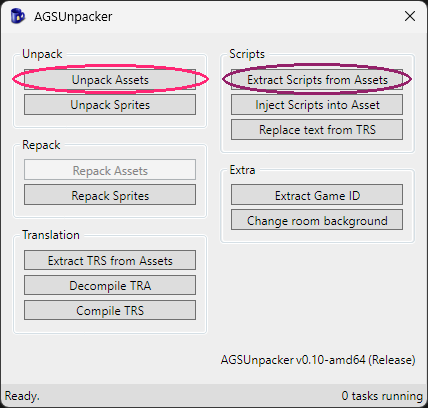

> **Tip:** Run **`Unpack Assets`** before **`Extract Scripts from Assets`**. Leave the `.scom3` files where AGSUnpacker puts them — you will import one into Ghidra in a later step. **`globalscript.scom3`** is a good first choice.

- [TODO: screenshot — unzipped **`AGSUnpacker_v010_x64`** folder showing **`AGSUnpacker.exe`** and support files]

---

## Step 2: Download and unzip Ghidra 10.4

ReAGS is built for **Ghidra 10.4** only. At the time of writing, [ReAGS 20240301](https://github.com/adm244/Ghidra-ReAGS/releases/tag/20240301) is the only release — do not mix it with other Ghidra versions.

1. Download **`ghidra_10.4_PUBLIC_20230928.zip`** (~353 MB) from the [Ghidra 10.4 release](https://github.com/NationalSecurityAgency/ghidra/releases/tag/Ghidra_10.4_build).
2. Unzip the download into a folder on your PC.
   - After unzipping you should have a folder named **`ghidra_10.4_PUBLIC`** (unpacked size is roughly **1 GB**).
   - Any location works — e.g. `C:\Tools\ghidra_10.4_PUBLIC` or your Desktop.
   - You can use Windows **Extract All**, 7-Zip, or any unzip tool.
3. Open the **`ghidra_10.4_PUBLIC`** folder and find **`ghidraRun.bat`** in its root (same level as the `Ghidra` and `support` folders).

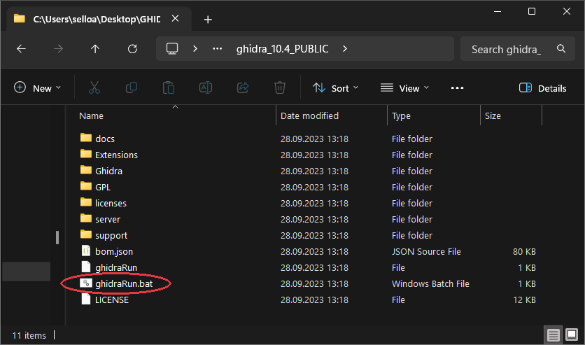

---

## Step 3: Install a JDK (required)

Ghidra **always** needs a Java Development Kit — it does not include one. Assume you need to install one unless you already know you have a compatible JDK on your PC.

Ghidra 10.4 officially requires a **64-bit JDK 17** or newer. An older or 32-bit Java install on your system will not work.

This guide uses **[Eclipse Temurin](https://adoptium.net/temurin/releases/)** because it is easy to download and install on Windows. You can use another JDK instead — what matters is that it is **recent enough**, **64-bit**, and that you know **where it was installed**.

1. Go to [Adoptium Temurin releases](https://adoptium.net/temurin/releases/).
2. Download the **Windows x64 `.msi` installer** for a current **JDK** build (pick **17 or newer** — example filename: `OpenJDK25U-jdk_x64_windows_hotspot_25.0.3_9.msi`, ~112 MB).
3. Run the installer with the default options.
4. After installation, note the **JDK home directory** — the top-level folder that **contains** `bin\java.exe`, **not** the `bin` folder itself. It is usually:

   ```
   C:\Users\YourName\AppData\Local\Programs\Eclipse Adoptium\jdk-25.0.3.9-hotspot
   ```

   Replace `YourName` with your Windows username and adjust the version number to match what you installed.

<!-- TODO: screenshot — JDK install folder showing bin\java.exe -->

> **Tip:** Open that folder in File Explorer and confirm you see a **`bin`** subfolder with **`java.exe`** inside. If you only see `java.exe` directly, go up one level — that parent folder is your JDK home.

---

## Step 4: Run Ghidra for the first time

1. Double-click **`ghidraRun.bat`** (from Step 2).
2. A **command window** opens while Ghidra starts. Watch it on first launch — this is where Ghidra may ask for your JDK path.
3. **If Ghidra asks for the JDK home directory:** paste the folder path from Step 3 (no `\bin` at the end). If a file picker appears, browse to that same folder and confirm.
   - You only need to do this once. Ghidra remembers the location afterward.
4. Ghidra opens the **Project Manager** window — the main screen where you create projects and import files (not the CodeBrowser yet).

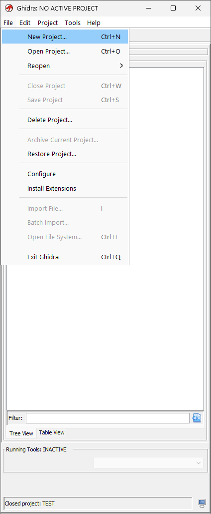

<!-- TODO: screenshot — JDK path prompt in the command window (not captured yet) -->

If Ghidra opens to the Project Manager, continue to **Step 5** (Install ReAGS).

If you see **`Failed to find a supported JDK`** or **`Java runtime not found`**, double-check Step 3 — wrong folder, too old a Java version, or a 32-bit install are the usual causes.

### Need more help with Ghidra?

If you get stuck getting Ghidra started, the **`ghidra_10.4_PUBLIC`** folder includes official 10.4 docs:

- **`docs\InstallationGuide.html`** — install, JDK, and troubleshooting (the **Ghidra Extension Notes** section also covers how to install extensions)
- **`docs\GhidraClass\Beginner\Introduction_to_Ghidra_Student_Guide_withNotes.html`** — annotated beginner slideshow

Easier-to-read online copies: [Installation Guide](https://ghidradocs.com/10.4_PUBLIC/docs/InstallationGuide.html) · [Introduction to Ghidra (Beginner)](https://ghidradocs.com/10.4_PUBLIC/docs/GhidraClass/Beginner/Introduction_to_Ghidra_Student_Guide.html)

For a broader setup walkthrough (JDK, extensions, and more), see [Sean Whalen's Ghidra setup guide](https://seanthegeek.net/posts/ghidra-setup-guide/).

---

## Step 5: Install the ReAGS extension

ReAGS teaches Ghidra how to read AGS `.scom3` script files. Download it from the only release published so far:

1. Download **`ghidra_10_4_PUBLIC_20240301_ReAGS.zip`** (~64 KB) from **[ReAGS 20240301](https://github.com/adm244/Ghidra-ReAGS/releases/tag/20240301)**.
   - **Do not unzip it** — Ghidra installs the zip as-is.
2. In Ghidra, open **`File`** → **`Install Extensions...`**
3. In the Install Extensions window, click the **green plus (+)** button.
4. Select the ReAGS `.zip` file and click **`OK`**.
5. ReAGS should appear in the list with its checkbox **enabled**.
6. Click **`OK`** to close the Install Extensions window.

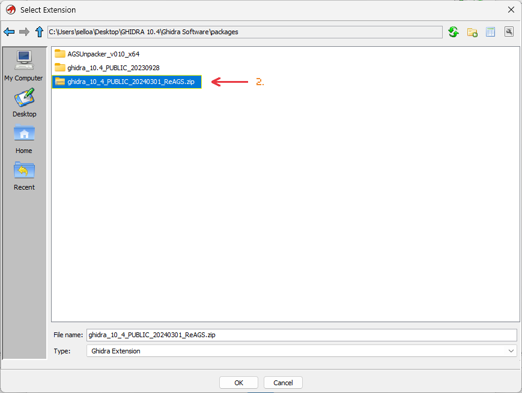

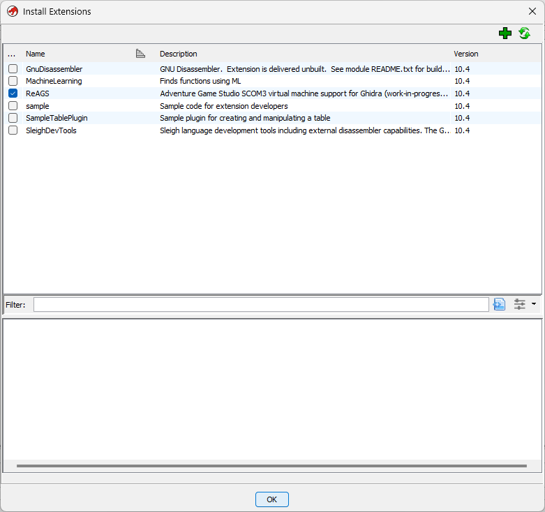

> **Important:** **Restart Ghidra completely** — close it and open `ghidraRun.bat` again — even if Ghidra does not tell you to. ReAGS may not work until you do.

---

## Step 6: Create a project and import a `.scom3` file

### Create a new project

1. In Ghidra, open **`File`** → **`New Project...`**
2. Select **`Non-Shared Project`** and click **`Next`**.
3. Choose a **project folder** (where Ghidra stores project files on your PC).
4. Enter a **project name** and click **`Finish`**.

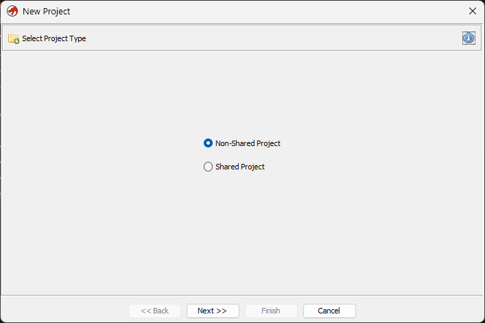

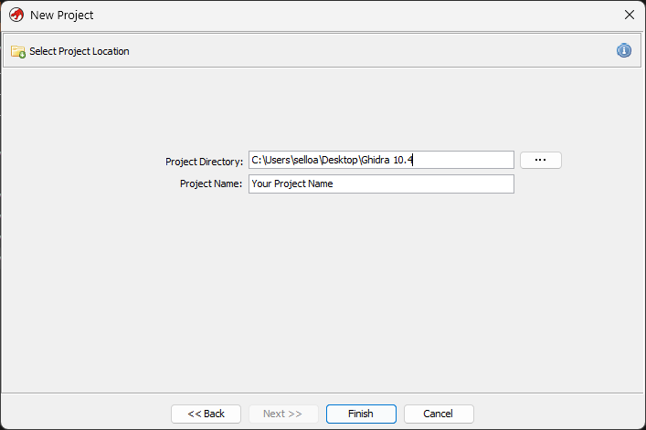

> **Tip:** ReAGS works on **`.scom3` script files**, not the game `.exe`. A common first import is **`globalscript.scom3`**. Pick any project name you like — e.g. `MyGameScripts`.

### Import a script file

1. Open **`File`** → **`Import File...`**
2. Browse to the **`scripts`** folder from Step 1.
3. Select any `.scom3` file and click **`OK`** / **`Open`**.

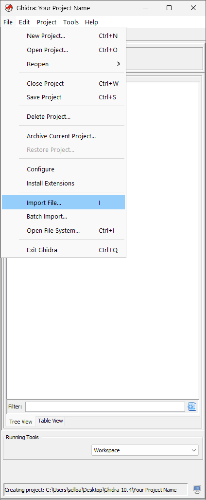

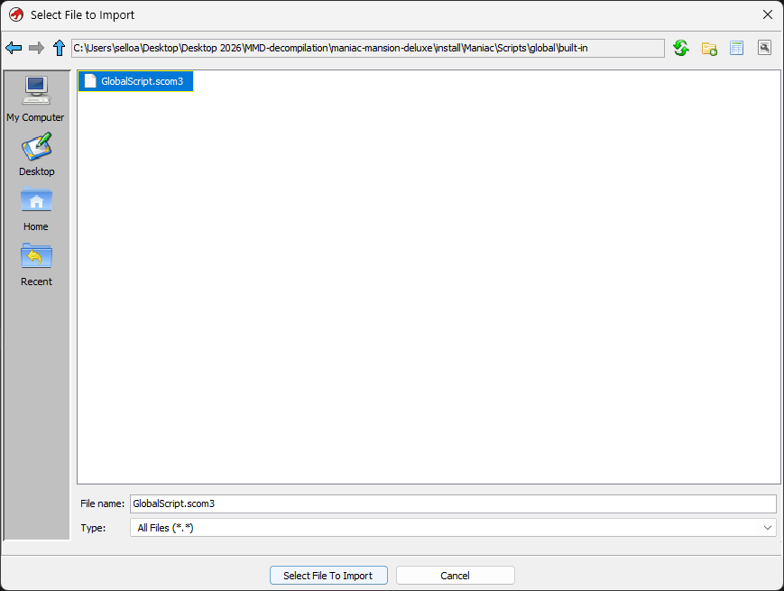

### Check the Import dialog

Before you confirm the import, verify these two lines:

| Field | Expected value |
|-------|----------------|
| **Format** | `Adventure Game Studio compiled script (scom3)` |
| **Language** | `AGSVM:LE.32:default:default` — **AGSVM** is the important part |

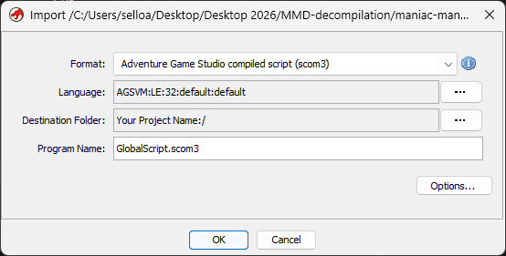

4. Click **`OK`** to import.
5. When the **Import Results Summary** appears, click **`OK`**.

> **If Format or Language look wrong:** ReAGS is probably not installed or not loaded. Go back to **Step 5**, confirm the extension is enabled, **restart Ghidra**, and try again.

---

## Step 7: Analyze the imported script

1. In the **Active Project** window, open the folder named after your project.
2. Double-click your imported `.scom3` file — or right-click it and choose **`Open With`** → **`CodeBrowser`**.

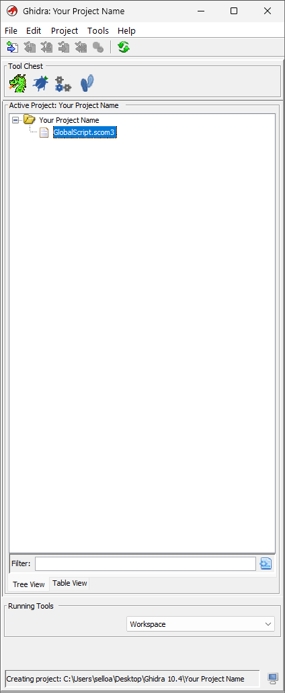

3. Ghidra will ask whether you want to analyze the file now. Click **`Yes`**.

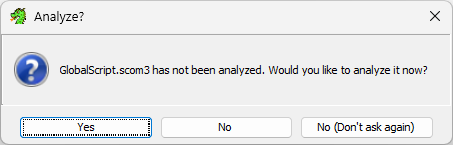

4. The **Analysis Options** window opens with many checkboxes. Leave the defaults as they are, but confirm these two are **checked**:
   - **`Scom3 Function Analyzer`**
   - **`Script format analyzer`**
5. Click **`Analyze`**.

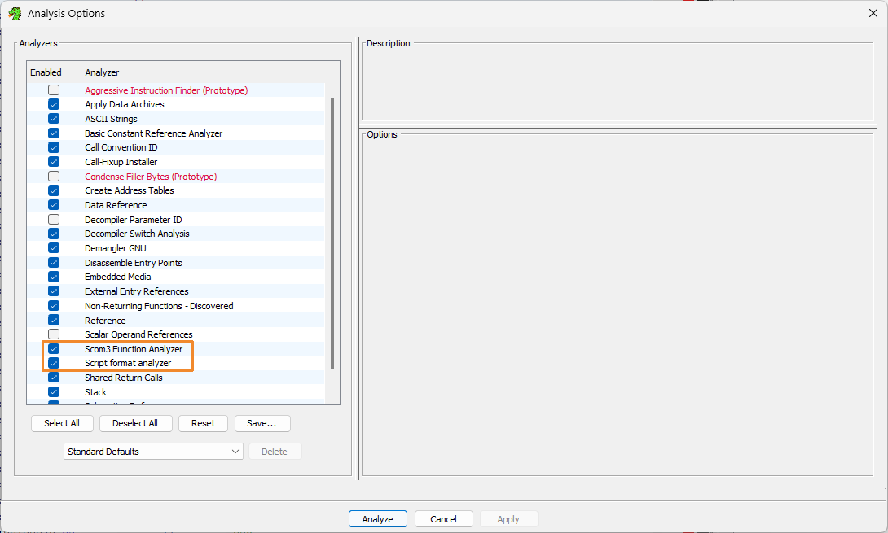

Wait for analysis to finish. Progress appears in the **status bar** at the bottom of CodeBrowser; when analysis is done, that progress indicator stops and you can click functions in the Symbol Tree.

> **You are almost done.** You can jump ahead to **Step 9** (Export) now, or continue to Step 8 for a quick look around.

> **Important:** Export your **`.c`** file (Step 9) **before** closing the CodeBrowser window. ReAGS may not keep your analysis when you close it.

---

## Step 8: Browse functions and decompiled output (optional)

This step shows you where Ghidra puts the readable-ish output. You do not need to understand everything here.

| Panel | Where | What it is |
|-------|-------|------------|
| **Symbol Tree** | Left sidebar | Lists function names found in the script |
| **Listing** | Center | Low-level view of the compiled script |
| **Decompile** | Right | Ghidra's pseudo-C output for the function you selected |

1. In the CodeBrowser **left sidebar**, find **`Symbol Tree`**.
2. Expand **`Functions`**.
3. Click a **named** function — one that looks like game logic (e.g. **`game_start`**, **`SetObjectPosition$3`**, **`dialog_request_1`**) rather than auto-generated names like **`FUN_08001234`**.
   - The **Decompile** panel shows **one function at a time**. Click a different function in the tree to switch what you see.

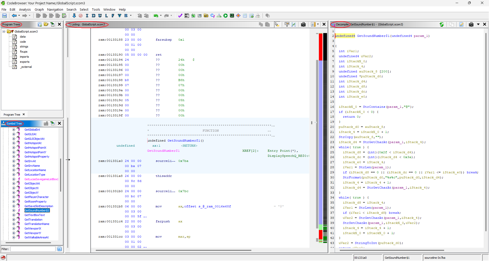

4. In the center **Listing** view, the cursor should jump to that function — something like:

   ```
   undefined GetSoundNumber$1
   ```

5. In the right **Decompile** panel, Ghidra shows pseudo-C code — an automated guess at what the original AGS script might have looked like.

The output will not match the original AGS source file line-for-line — expect odd variable names, missing structure, and some functions that decompile poorly. Many users still find it readable enough to reconstruct lost script logic.

For deeper reading after this tutorial, see **Further reading** below.

---

## Step 9: Export the decompilation

1. In CodeBrowser, open **`File`** → **`Export Program...`**
2. Set **Format** to **`C/C++`**.
3. Set **Output File** to a new name — **do not overwrite** your original `.scom3` file.
   - Pick a folder and a filename such as `globalscript_export` (Ghidra adds the **`.c`** extension).
4. Click **`OK`**.

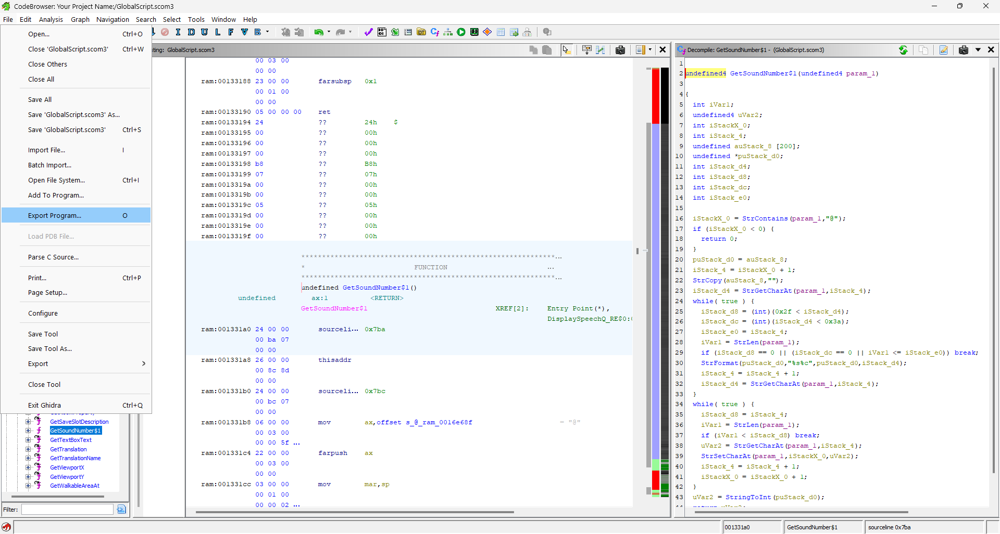

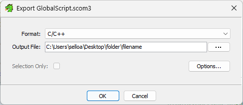

### You should see

- A new **`.c`** file on disk (e.g. `globalscript_export.c`) containing pseudo-C for the decompiled functions

Open the exported file in Notepad or any text editor.

> If it feels like looking into the Matrix or a magic 8 ball, you are on the right track.

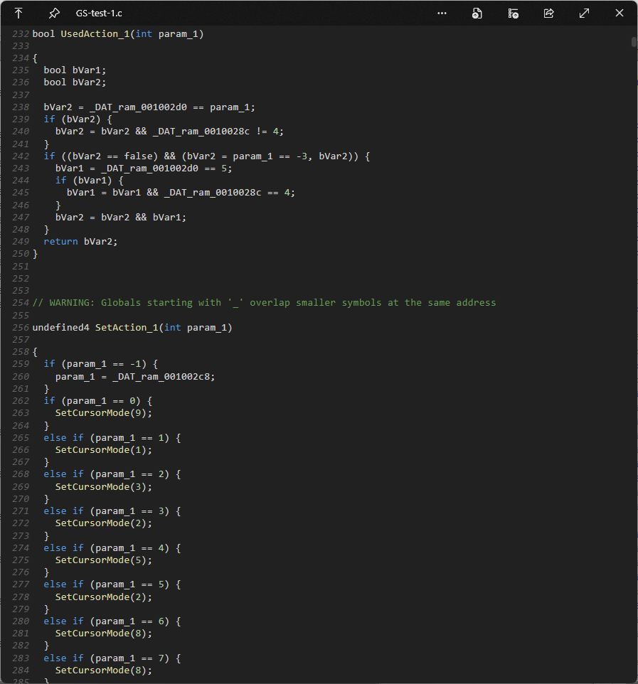

---

## Summary checklist

Use this to confirm you completed every stage:

- [ ] Extracted `.scom3` files with AGSUnpacker
- [ ] Downloaded and unzipped Ghidra **10.4**
- [ ] Ghidra launches successfully (`ghidraRun.bat`)
- [ ] Installed a **64-bit JDK** and pointed Ghidra at it (Step 3–4)
- [ ] Installed **ReAGS 20240301** from the `.zip` and **restarted Ghidra**
- [ ] Created a Non-Shared project
- [ ] Imported a `.scom3` — Format and Language matched the expected values
- [ ] Ran analysis with **Scom3 Function Analyzer** and **Script format analyzer**
- [ ] Exported decompilation as **C/C++**
- [ ] Opened the exported file and confirmed it contains text output

---

## Troubleshooting

### Import shows the wrong Format or Language

- Confirm you are running **Ghidra 10.4** with **ReAGS 20240301** — the [only ReAGS release](https://github.com/adm244/Ghidra-ReAGS/releases/tag/20240301) at the time of writing.
- Open **`File`** → **`Install Extensions...`** and verify ReAGS is checked.
- **Restart Ghidra** fully and try importing again.

### Ghidra will not start / Java errors

- Ghidra **always** needs a JDK — install one (Step 3) if you have not yet.
- Use a **64-bit JDK 17** or newer. Very old Java or 32-bit installs will fail.
- When pasting the JDK path, use the folder **above** `bin`, not `...\bin` itself.
- Confirm `bin\java.exe` exists inside the folder you chose.
- If you already had Java installed, it may be the wrong version — install Temurin (or another current JDK) and point Ghidra at that install instead.

### ReAGS analyzers do not appear in Analysis Options

- ReAGS is not loaded — repeat Step 5 and restart Ghidra.
- [TODO: Other causes?]

### Decompile window stays empty after analysis

- Click a **named function** in Symbol Tree → **Functions** — the Decompile panel only updates when a function is selected.
- If the Listing shows **`??`** at function addresses, try: select the **`code`** memory block → right-click → **Disassemble** → run **Analysis** again.
- [TODO: Other edge cases you hit during testing]

### Export failed or file is empty

- Make sure analysis finished and at least some functions decompile when clicked individually.
- [TODO]

### AGSUnpacker did not produce a `scripts` folder

- Make sure you clicked **`Unpack Assets`** first, then **`Extract Scripts from Assets`** — in that order.
- Confirm you selected the game's **`.exe`**, not a shortcut or unrelated file.
- AGSUnpacker targets officially released **AGS 2.x and 3.x** games. Very old 1.x games, AGS 4.x, or heavily customized builds may not work.
- [TODO: Where the `scripts` folder should appear on disk — verify once and add a screenshot path]

### AGSUnpacker.exe will not start

- Install the **[.NET 6 Desktop Runtime](https://dotnet.microsoft.com/en-us/download/dotnet/6.0)** (64-bit). AGSUnpacker v010 is built for **.NET 6** and is not self-contained.

---

## What to expect from ReAGS

The following is paraphrased from the [ReAGS README](https://github.com/adm244/Ghidra-ReAGS) and its **Known issues** list — not original guidance from this tutorial.

ReAGS is a **Ghidra 10.4** plugin (same author as AGSUnpacker). The README describes the project as **halfway finished** and **no longer being developed**. [ReAGS 20240301](https://github.com/adm244/Ghidra-ReAGS/releases/tag/20240301) is the **only release** listed at this time.

The author notes that ReAGS **can still be used** in its current state, but that users **should not expect a smooth experience**.

**Known issue (major):** analysis state **is not saved** into project files. According to the README, closing the CodeBrowser window can **lose all work from that session** — so **export the `.c` file before closing Ghidra**.

The README also lists **incorrect decompilation** as a known issue; the author’s wording is that this becomes obvious when reviewing the output.

[TODO: Optional — link to assembly/listing as fallback when decompilation fails (author note in Page build notes).]

---

## Further reading

- [Ghidra-ReAGS README](https://github.com/adm244/Ghidra-ReAGS) — project status, supported Ghidra version, full known-issues list
- [ReAGS 20240301 release](https://github.com/adm244/Ghidra-ReAGS/releases/tag/20240301)
- [AGSUnpacker README](https://github.com/adm244/AGSUnpacker) — supported AGS versions, feature list
- [AGSUnpacker releases](https://github.com/adm244/AGSUnpacker/releases) — download current builds
- [Ghidra official site](https://ghidra-sre.org/)
- [ ] [TODO: AGS forums / community links]

---

## Reference links

| Resource | URL |
|----------|-----|
| Ghidra (official site) | https://ghidra-sre.org/ |
| Ghidra 10.4 download | https://github.com/NationalSecurityAgency/ghidra/releases/tag/Ghidra_10.4_build |
| Ghidra on GitHub | https://github.com/NationalSecurityAgency/ghidra |
| Ghidra-ReAGS 20240301 | https://github.com/adm244/Ghidra-ReAGS/releases/tag/20240301 |
| Ghidra-ReAGS (repo) | https://github.com/adm244/Ghidra-ReAGS |
| AGSUnpacker v010 | https://github.com/adm244/AGSUnpacker/releases/tag/v010 |
| .NET 6 Desktop Runtime | https://dotnet.microsoft.com/en-us/download/dotnet/6.0 |
| Temurin JDK (Adoptium) | https://adoptium.net/temurin/releases/ |
| Ghidra overview (Wikipedia) | https://en.wikipedia.org/wiki/Ghidra |

---

## Page build notes (remove before publishing)

<!-- Internal notes for you — not part of the public tutorial -->

- **Visual target:** [HandBrake Quick Start](https://handbrake.fr/docs/en/latest/introduction/quick-start.html) — clean headings, UI labels in monospace, one screenshot per step.
- **Structure target:** [Mediaket HandBrake guide](https://tutorials.mediaket.net/software-tutorials/handbrake-tutorial.html) — numbered steps, tip callouts, end checklist.
- **ReAGS context (author notes — do not dump all of this into the public tutorial):**
  - Only release: [20240301](https://github.com/adm244/Ghidra-ReAGS/releases/tag/20240301), Ghidra 10.4 only
  - Project halfway finished, no longer developed — user-facing section: **What to expect from ReAGS**
  - Known issues to keep in mind when writing/expanding: analysis state not saved (MAJOR); decompilation sometimes incorrect; p-code emulation broken; AGS341.gdt is test-only
  - Adam (author): when decompilation obviously fails, base reconstruction on assembly
- **Screenshot naming:** `step-NN-description.png` (tutorial), `step-NN-*-alt.png` (spares), `ref-*` (reference), `video-*` (recordings). Step numbers match tutorial steps; step 3 (JDK) has no image yet.

- **Screenshot map:**

  | Step | File |
  |------|------|
  | 1 | `step-01-agsunpacker-buttons.png` |
  | 2 | `step-02-ghidra-folder.png` |
  | 3 | *(missing — `step-03-jdk-folder.png`)* |
  | 4 | `step-04-project-manager-no-project.png` |
  | 5 | `step-05-reags-select-zip.png`, `step-05-reags-extension-list.png` |
  | 6 | `step-06-new-project-type.png`, `step-06-new-project-location.png`, `step-06-import-file-menu.png`, `step-06-import-file-picker.png`, `step-06-import-format-language.png` |
  | 7 | `step-07-project-with-scom3.png`, `step-07-analyze-prompt.png`, `step-07-analysis-options.png` |
  | 8 | `step-08-codebrowser-decompile.png` |
  | 9 | `step-09-export-file-menu.png`, `step-09-export-dialog.png`, `step-09-exported-c-file.png` |

- **Spares / unused in tutorial:**
  - `step-01-agsunpacker-ui-alt.png`
  - `step-06-file-menu-alt.png`
  - `step-06-import-results-summary.png`
  - `step-07-codebrowser-tools-alt.png`
  - `step-07-analysis-options-alt.png`
  - `ref-ghidra-net.png`, `ref-wikipedia-ghidra-*`
  - `video-download-*.mp4`

- **Build site:** `python build.py` → reads `tutorial.md`, writes `index.html` (strips this section and HTML comments).
